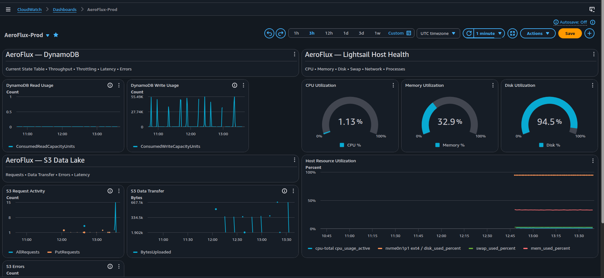

## Demo Videos

Walkthroughs showcasing each part of the AeroFlux.

### AeroFlux Dashboard View

<video
    autoplay
    loop
    muted
    controls
    playsinline
    style="width: 100%; max-width: 1200px;"
>
    <source src="assets/videos/af-app-demo.mp4" type="video/mp4">
</video>

### Live Flight Map & Network Overview

<video
    autoplay
    loop
    muted
    controls
    playsinline
    style="width: 100%; max-width: 1200px;"
>
    <source src="assets/videos/af-live-network-map-demo.mp4" type="video/mp4">
</video>

### Live Inference

<video
    autoplay
    loop
    muted
    controls
    playsinline
    style="width: 100%; max-width: 1200px;"
>
    <source src="assets/videos/af-live-inference-demo.mp4" type="video/mp4">
</video>

### Model Performance Page

<video
    autoplay
    loop
    muted
    controls
    playsinline
    style="width: 100%; max-width: 1200px;"
>
    <source src="assets/videos/af-model-performance-demo.mp4" type="video/mp4">
</video>

### Analyst Agent

### Full Integration 

<video
    autoplay
    loop
    muted
    controls
    playsinline
    style="width: 100%; max-width: 1200px;"
>
    <source src="assets/videos/af-integrated-demo-v2.mp4" type="video/mp4">
</video>

### AeroFlux Cloud Monitoring & Observability 

### Operations On-Prem 
<video
    autoplay
    loop
    muted
    controls
    style="width: 100%; max-width: 1200px;"
>
    <source src="assets/videos/ops-on-prem-demo.mp4" type="video/mp4">
</video>

### Project Setup 
