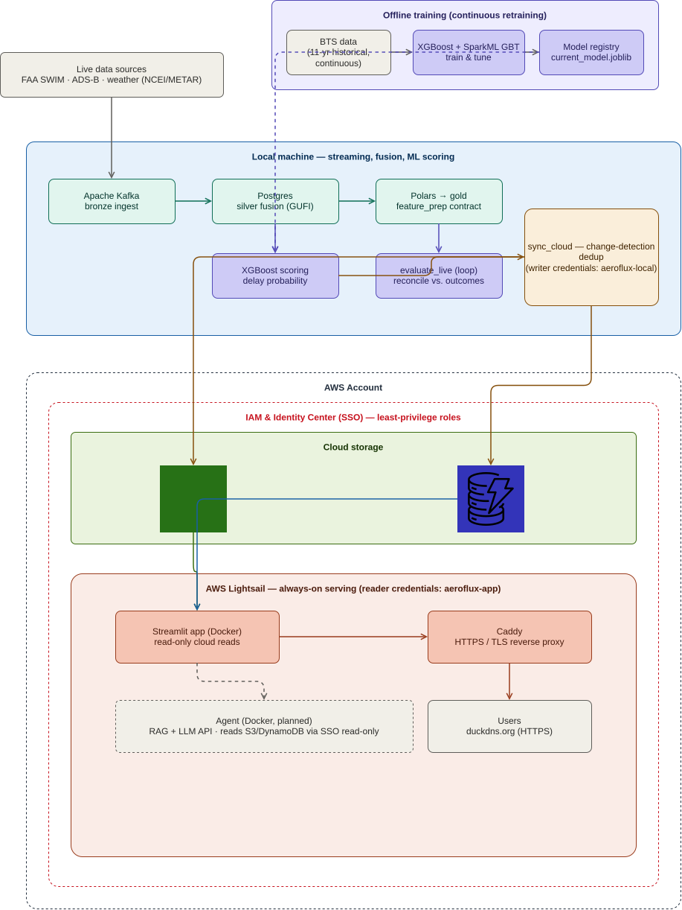

:::: {.content-visible when-format="html"}
::: {.callout-note appearance="minimal"}
**Course:** AIT 614 Sec 001  
**Instructor:** Dr. Duoduo Liao  
**Institution:** George Mason University
:::
::::

:::: {.content-visible when-format="pdf"}
::: {.callout-note appearance="minimal"}
**Course:** AIT 614 Sec 001  
**Instructor:** Dr. Duoduo Liao  
**Institution:** George Mason University
:::

```{=latex}
\thispagestyle{empty}
```


::::

:::: {.content-visible when-format="docx"}
::: {.callout-note appearance="minimal"}
**Course:** AIT 614 Sec 001  
**Instructor:** Dr. Duoduo Liao  
**Institution:** George Mason University
:::


::::

<!-- ============================================================= -->
<!-- ABSTRACT                                                       -->
<!-- ============================================================= -->

# Abstract {.unnumbered}

<!-- TODO: 150-250 word abstract. Write LAST, once results are final.
Cover in order: (1) the problem — delays propagate through the NAS and existing
tools are siloed; (2) what AeroFlux is — a portable, real-time fusion + ML
platform with flight-delay prediction as the proof-of-concept; (3) what was
built — SWIM/ADS-B/weather fusion, XGBoost scoring, cloud deployment, live
evaluation; (4) the headline findings — discrimination transfers to live but
calibration degrades under distribution shift (quantified), plus the system
metrics (throughput, footprint, cost); (5) the contribution — propagation-aware
modeling of cascading state in a tightly-coupled physical system. -->

_TODO: abstract goes here (write last)._

<!-- ============================================================= -->
<!-- 1. INTRODUCTION                                                -->
<!-- ============================================================= -->

# Introduction

Flight delays are among the most costly and disruptive failures in the U.S.
National Airspace System (NAS), and they rarely occur in isolation. A single
late arrival propagates downstream through the same aircraft's rotation and
through shared airport departure and arrival queues, so a local disturbance
becomes a network-wide disruption.

Although airlines, airports, and air traffic authorities increasingly use
real-time and predictive decision-support systems, these capabilities are often
specialized around particular organizations, operational domains, or stages of
flight. For example, the FAA's Traffic Flow Management System supports
demand-and-capacity management across the National Airspace System, while
Terminal Flight Data Manager integrates surface and national traffic-management
data to improve airport operations [@faa_nextgen_2024; @faa_tfdm_2020].
Commercial platforms such as Sabre Mosaic support airline disruption recovery,
and Assaia ApronAI uses computer vision and machine learning to monitor aircraft
turnarounds and predict departure readiness
[@sabre_disruption_management; @assaia_apronai]. Opportunities therefore remain
for integrated research platforms that fuse multiple live aviation data streams,
model delay propagation across the broader flight network, and support
forecasting, simulation, data science, and AI-assisted analysis.

## Problem Statement

### The Problem: Cascading Failure in Tightly-Coupled Systems

A **flight delay** — an arrival later than scheduled, conventionally by 15 or
more minutes — is rarely an isolated event. Aircraft fly sequential legs, so a
late inbound flight delays its own next departure (**rotational propagation**);
airports have finite runway and gate capacity, so congestion at one flight's
origin ripples to every flight sharing that resource (**queue propagation**).
Through these mechanisms, a single local disturbance becomes a network-wide
disruption. This is **delay propagation**, and it matters operationally because
the window to act on a disruption closes as it spreads — by the time a cascade
is visible in aggregate, the cheapest interventions are already gone.

Compounding this, live operational data arrives as **heterogeneous, imperfect
streams** — FAA SWIM flight messages, ADS-B aircraft positions, weather
observations — that share no universal key and are measured differently from the
historical records used to train models (**distribution shift**). Fusing these
into a single, queryable operational view requires backward-looking temporal
joins, UTC normalization, spatial matching, and entity resolution across systems
that don't agree on identity. This is the same class of real-time,
multi-sensor data-fusion problem now central to edge AI, autonomy, and robotics:
large, fast, noisy signals that must be fused and reasoned over in real time.

### Contribution

Complex systems fail when disruptions propagate faster than their defenses can
adapt. Reason's Swiss Cheese model frames accidents as the momentary alignment
of holes across successive layers of defense — but the classic model is static.
It names the holes; it does not show which are aligning, or how fast. In a
live, tightly-coupled system, the holes are *moving*.

AeroFlux's contribution is a **dynamic defensive layer**: one that fuses live
signals to see the holes forming, predicts their alignment, and gives operators
time to act. Concretely, this means (1) real-time fusion of heterogeneous
aviation and weather streams into a canonical, propagation-aware per-flight
state; (2) predictive modeling of emerging delay risk with the network context
(rotation, demand, weather) that drives propagation; and (3) an explainable
analyst layer that makes those predictions inspectable in natural language.

We use the U.S. National Airspace System as a **proving ground**. Flight delay
was chosen deliberately — not because it is unsolved, but because it is
well-studied, has abundant public ground truth, and keeps prediction errors
low-stakes, giving rapid feedback for developing and validating methods. The
delay problem is the instance; the contribution is the *approach* — a
real-time, network-aware intelligence layer for anticipating cascading
consequences in tightly-coupled systems — which is designed to extend to other
safety-critical cyber-physical domains.


### Scope and Vision

This stage focused primarily on building the **infrastructure** such a layer
requires: portable real-time ingestion and fusion, a train/serve-consistent
feature pipeline, cloud-backed serving, live evaluation, and an explainable
agent. It is foundation, not final form.

The longer-term vision is cyber-physical situational awareness for complex
adaptive systems — emphasizing data fusion, propagation modeling, downstream-
effect reasoning, and decision intelligence. Natural next directions include
network-aware simulation, an operational digital twin of the airspace, and
agentic reasoning over fused state; further out, the same fusion-and-propagation
core could extend beyond aviation toward a multi-domain autonomy and
decision-support layer. We hold these directions as directions, not commitments —
broad, foundational work of this kind is most valuable when it leaves room for
the solution space to reveal where it should go next.

**Positioning.** AeroFlux is explicitly *not* a replacement for certified
collision-avoidance (ACAS/ATAS), air traffic control, or pilot tools. It is a
higher-level, pre-tactical **fusion, simulation, and decision-support layer**
that complements them — turning operations from reactive to anticipatory rather
than intervening in the tactical safety loop.

## Technical Challenges

Building this platform requires solving several non-trivial problems:
(1) ingesting heterogeneous, error-prone streaming sources (FAA SWIM XML, ADS-B,
weather) without data loss; (2) *entity resolution* across systems that share no
universal key — for example, the aircraft tail number is not published in SWIM
flight data and must be recovered from ADS-B, which itself has limited coverage;
(3) unstable identifiers, since a flight's `flight_ref` changes on plan amendment
while its Globally Unique Flight Identifier (GUFI) remains stable; (4)
train/serve skew, because historical labels (Bureau of Transportation
Statistics) and live features are measured differently; and (5) delivering all
of this at demo quality on a portable, low-cost footprint.

<!-- TODO: optionally add a sentence noting which of these were solved, partially
solved, or remain open — forward-references the Limitations section. -->

<!-- ============================================================= -->
<!-- 2. RELATED WORK                                                -->
<!-- ============================================================= -->

# Related Work

<!-- Retained from proposal — trim/update as needed for a final paper. -->

**Machine-learning delay prediction.** Prior work frames delay prediction as
supervised classification or regression over historical records. The review by
@sternberg2017review describes the major approaches used for flight-delay
prediction, while more recent work continues to evaluate machine-learning
algorithms and class-imbalance handling [@albassam2025flight]. These approaches
can achieve strong predictive performance on curated historical datasets.
However, when used in isolation, they may remain largely retrospective, rely on a
limited set of data sources, and model flights as independent observations. These
assumptions can restrict their ability to capture the temporal, spatial, and
operational dependencies through which delays propagate across the aviation
network.

**Delay-propagation modeling.** A separate literature models how delays ripple
through airline schedules. @beatty1999preliminary introduced an early method for
evaluating delay propagation through an airline schedule, @wong2012survival
applied a survival model, and @kafle2016propagation proposed an
analytical-econometric approach. These methods capture important propagation
mechanisms but are generally offline and disconnected from real-time streaming
prediction. @belcastro2016flight demonstrated scalable data mining for
flight-delay prediction, establishing the value of big-data tooling while leaving
room for tighter integration with real-time data fusion.

**Operational data fusion.** The state of the art in operational systems
includes NASA's Airspace Technology Demonstration 2 (ATD-2) *Fuser*, which fuses
multiple aviation data sources into a unified flight record
[@nasa2021atd2fuser]. Its strength is production-grade fused operational data;
its limitation for this project is that it is not designed as a lightweight,
open, extensible ML/AI experimentation platform. This project leverages some of
the high-level concepts used in ATD-2 to create its own fuser.

**Emerging aviation intelligence systems.** Recent operational systems show that
the field is moving beyond static delay prediction toward real-time prediction,
simulation, and decision support. FlightAware Foresight represents production
ML-driven predictive flight tracking, including arrival-time, taxi-out, and
runway predictions [@flightawareForesight]. NASA's NAS Digital Twin and Project
Bluebird extend this direction toward replayable and probabilistic simulation
environments for live or historical airspace operations and AI-agent evaluation
[@lauderdale2024nasDigitalTwin; @pepper2026probabilisticTwin]. Commercial
platforms such as Airspace Intelligence PRESCIENCE, Lufthansa Systems
NetLine/Ops++ aiOCC, and Amadeus Flight Operations Control show the market moving
toward 4D operating-domain twins, AI-assisted operations control, disruption
recovery, and resource-aware decision support
[@airspaceIntelligencePrescience; @lufthansa2025aiocc; @amadeusFlightOps]. Recent
prototypes such as FlightSense further combine rotation-chain features, real-time
MLOps, and conversational/agentic interfaces for delay prediction
[@shelke2026flightsense], while the FAA AI safety roadmap highlights the need for
assurance, incremental deployment, and aviation-specific safety methods when
adding AI to operational contexts [@faa2024airoadmap]. Together, these efforts
motivate AeroFlux as a lightweight, SWIM-native experimentation platform that
connects real-time data fusion, propagation-aware ML, replay, and
explainable/agentic analysis rather than treating delay prediction as a
standalone model.

**Relevance of this approach.** AeroFlux Stage 2 bridges these strands. It
couples lightweight, Fuser-inspired real-time fusion and entity resolution with
propagation-aware feature engineering and an explainable retrieval-augmented
agent — integrating capabilities that prior work often treats separately.

<!-- ============================================================= -->
<!-- 3. DATA                                                        -->
<!-- ============================================================= -->

# Data and Fusion

## Data Sources

<!-- Retained from proposal. UPDATE the retained-size estimates to ACTUAL
measured figures now that the system has run (e.g. the 0.51 MB S3 gold, the
~163K distinct flights / 48h in DynamoDB, the real BTS parquet size). -->

The platform fuses live and historical aviation and weather sources, plus
reference dimensions and a documentation corpus, summarized in @tbl-datasets.
FAA SWIM provides the authoritative live NAS flight state [@faa_swim]; ADS-B
supplies the physical airframe identity (ICAO 24-bit address and registration)
needed to link an aircraft's successive legs, drawn from community feeds
[@airplaneslive; @adsblol], whose research value is demonstrated by large-scale
networks such as OpenSky [@schaefer2014opensky]; NOAA weather — a leading delay
driver — is drawn from live METAR via the Aviation Weather Center [@awc_metar]
for serving and the NCEI Integrated Surface Database for historical training
[@ncei_isd]; and the BTS On-Time Performance dataset, which includes actual gate
times and tail numbers, provides historical training labels [@bts_ontime].
Reference dimensions for airports and airlines [@ourairports; @openflights]
support entity resolution, code normalization, and timezone alignment.

| Source | Type | Role | Retention | Estimated retained size |
|---|---|---|---|---|
| FAA SWIM (TFMS) | Streaming XML | Live flight state (primary) | 48 h | Approximately 5–25 GB |
| ADS-B (airplanes.live / adsb.lol) | Streaming JSON | Airframe and tail resolution | 48 h | Approximately 2–10 GB |
| NOAA weather — METAR (AWC) + NCEI ISD hourly | Polled JSON / text | Weather: METAR for serving, NCEI for training | 48 h | Approximately 50–250 MB live |
| BTS On-Time Performance | Historical CSV / Parquet | Historical training labels | Persistent | Approximately 20–40 GB as CSV or 4–10 GB as Parquet |
| Aviation documents (FAA, SWIM dictionaries, and related references) | PDF / HTML / text | RAG documentation corpus | Persistent | Approximately 0.5–2 GB, including extracted text and embeddings |
| Reference dimensions (airports, airlines) | Static CSV | Entity resolution, ICAO/IATA + timezone normalization | Persistent | < 50 MB |

: AeroFlux Stage 2 data sources, retention policies, and estimated storage requirements. Estimated sizes are project-planning ranges rather than published source totals and depend on geographic scope, ingestion frequency, selected fields, compression, and duplicate handling. {#tbl-datasets}

## Fusion and Canonical Records

A raw SWIM message (abridged) is shown in @lst-swim; the corresponding fused,
validated canonical record produced by the ingestion pipeline is shown in
@lst-record. Each SWIM document explodes into one record per flight, which the
pipeline fuses by GUFI across many messages over time.

```{.xml #lst-swim lst-cap="Raw SWIM TFMS flight message (abridged)."}
<fdm:fltdMessage acid="AAL2033" airline="AAL" arrArpt="KLGA" depArpt="KCLT"
   flightRef="150976233" msgType="FlightModify" ...>
  <nxcm:flightStatus>PLANNED</nxcm:flightStatus>
  <nxcm:aircraftModel>A320</nxcm:aircraftModel>
  <nxcm:flightTimeData airlineOutTime="2026-07-04T15:39:00Z"
                       airlineInTime="2026-07-04T17:35:00Z"/>
</fdm:fltdMessage>
```

```{.json #lst-record lst-cap="Fused, schema-validated canonical flight-instance record."}
{ "flight_instance_id": "KN6770564K", "callsign": "AAL2033",
  "flight_number": "AA2033", "carrier_name": "American Airlines",
  "origin": "KCLT", "destination": "KLGA", "aircraft_type": "A320",
  "scheduled_gate_departure": "2026-07-04T15:39:00Z",
  "estimated_arrival": "2026-07-04T17:41:00Z", "flight_status": "PLANNED",
  "resolution_status": "airline_resolved", "schema_version": "1.0" }
```

<!-- TODO: Describe the fusion mechanics in more depth than the proposal did,
now that it's built:
 - GUFI as the stable merge key; flight_ref instability handled.
 - Bronze (Kafka/raw) -> silver (Postgres flight_instance, 48h, GUFI-keyed) ->
   gold (Polars parquet feature/label tables).
 - ADS-B airframe (tail/hex) resolution, why SWIM omits it, coverage reality (~38%).
 - The single feature_prep contract that guarantees train/serve parity. -->

_TODO: expanded fusion description and tier diagram/figure._

<!-- ============================================================= -->
<!-- 4. METHODS                                                     -->
<!-- ============================================================= -->

# Methods

## System Architecture

<!-- TODO: Insert the UPDATED architecture figure (the new draw.io diagram:
offline BTS training, live pipeline, S3/DynamoDB, Lightsail serving, IAM/SSO
boundaries, planned agent). Replace the old proposal figure path. -->

::: {.content-visible when-format="html"}
{#fig-aeroflux-arch .lightbox}
:::
::: {.content-visible when-format="pdf"}
{#fig-aeroflux-arch}
:::
::: {.content-visible when-format="docx"}
{#fig-aeroflux-arch width=100%}
:::

<!-- TODO: 2-3 paragraphs. The local↔cloud split (streaming/ML local; durable
data to S3/DynamoDB; always-on Streamlit on Lightsail reads cloud only). The
bronze→silver→gold tiers. Container-first / config-toggle portability. Note what
was actually built vs. the proposal (e.g. Polars used in place of Spark for this
scale; MinIO/Athena path documented but S3/DynamoDB used). -->

_TODO: architecture prose._

## Ingestion and Streaming

<!-- TODO: SWIM/ADS-B/weather producers -> Kafka topics (48h retention) ->
consumer fuses to Postgres silver. The self-healing ingest (auto-reconnect,
real-liveness health check). Feature/inference core on Polars (note Spark
Structured Streaming foreachBatch as the documented scale path). -->

_TODO: ingestion + streaming._

## Feature Engineering

<!-- TODO: The single source-agnostic feature_prep contract (train/serve parity
by construction). The 18-feature default set: 5 structural + 5
rotation/propagation + 4 demand/recent-delay + 4 weather (wind/IFR). The fill
policy (fill-0 / leave-null / drop-structural) and WHY (XGBoost routes NaN).
propagation_pressure_min = max(0, prev_leg_arr_delay - turnaround_buffer).
Weather scored at scheduled departure to prevent leakage. temp/ceiling/vis as
the opt-in parity-gap fields. -->

_TODO: feature engineering + the parity argument._

## Modeling

<!-- TODO: Baseline logistic regression vs. advanced XGBoost (+ SparkML GBT as
the distributed path). Target: 15-min arrival-delay classification. Continuous
retraining as new BTS data arrives. Model registry. SHAP explainability. -->

_TODO: models._

## Training and Validation Strategy

<!-- TODO: THE ML-rubric-heavy section. Cover explicitly:
 - Feature selection (how the 18 features were chosen; importances).
 - Train/test split — time-aware split, why (no random split on temporal data).
 - Cross-validation approach (time-aware CV).
 - Hyperparameter tuning (grid + time-CV).
 - TEMPORAL LEAKAGE PREVENTION — point-in-time features, weather scored at
   scheduled departure, no future information, scored_at precedes outcome.
 - Class imbalance handling if any. -->

_TODO: train/test strategy, tuning, leakage prevention._

## Live-Prediction Evaluation

<!-- TODO: The novel bit — evaluating a STREAMING predictor. Explain:
 - Predictions made at scheduled-departure; ground truth arrives hours later at
   landing. Required adding a prediction LOG (serving path is current-state by
   design) to reconcile earlier predictions against later realized outcomes.
 - Lag-bucketed reconciliation (24h+ / 6-24h / 2-6h / 0.5-2h / <30min) — reveals
   accuracy as a function of prediction horizon; avoids hindsight leakage.
 - Ground truth = own pipeline's arr_delay_min backfilled into later gold
   snapshots (free, automatic); FlightAware only as optional external corroboration. -->

_TODO: live-eval methodology._

## Agent Prototype

<!-- TODO (Ryan / pending): RAG over aviation-doc corpus, LangGraph constrained
workflow, read-only tool calling, LLM via API (Bedrock/Anthropic). Runs as a
separate service reading S3/DynamoDB via read-only SSO; app calls it via
AEROFLUX_AGENT_URL -> {question,history} -> {answer,citations}. Evidence-grounded
briefs, no operational decisions. Mark clearly as prototype / in-progress. -->

_TODO: agent prototype (coordinate with Ryan)._

<!-- ============================================================= -->
<!-- 5. EVALUATION AND RESULTS                                      -->
<!-- ============================================================= -->

# Evaluation and Results

We evaluate at two levels, each against an explicit baseline: predictive (model)
performance and system performance.

## Predictive Performance

<!-- TODO: BTS held-out metrics vs. LIVE reconciled metrics, same metric family:
ROC-AUC, PR-AUC, F1, Brier, confusion matrix, calibration curve. Present the
comparison table. LEAD WITH DISCRIMINATION (AUC). Be honest and precise:
 - BTS training AUC ~0.88 (clean, dense features).
 - Live AUC — report the MATURE number once the eval sample resolves (NOT the
   ~0.59 censoring-artifact figure; that number reflects an immature,
   right-censored sample that under-represents delayed flights). Wait for the
   backlog to resolve before finalizing.
 - Per-lag-bucket accuracy: expect it to sharpen as the horizon shortens.
 - Calibration curve showing over-prediction, attributed to distribution shift. -->

_TODO: predictive results — BTS vs. live comparison table + calibration curve._

<!-- Placeholder comparison table — replace with final numbers. -->

| Metric | BTS training (held-out) | Live (reconciled) |
|---|---|---|
| ROC-AUC | _TODO_ | _TODO_ |
| PR-AUC | _TODO_ | _TODO_ |
| F1 | _TODO_ | _TODO_ |
| Brier | _TODO_ | _TODO_ |
| n | _TODO_ | _TODO_ |

: Predictive performance, historical training vs. live reconciled evaluation. {#tbl-predictive}

## Feature Importance

<!-- TODO: XGBoost feature importances (the 18 features ranked). Tie the top
features back to the propagation/demand/weather story. Screenshot from the Model
Performance page works here. -->

_TODO: feature importance figure + discussion._

## System Performance

<!-- TODO: The system baseline-vs-achieved story. Report:
 - Sustained throughput (messages/sec).
 - Ingestion-to-gold latency.
 - Airframe-resolution (hex) coverage (~37%).
 - Fusion completeness (per-flight field fill rates).
 - Resource footprint — the headline efficiency numbers (S3 gold ~0.51 MB,
   DynamoDB size, Lightsail memory ~270 MB / 3.7 GB, cost).
 - The DynamoDB write optimization: ~18x / 94.6% write reduction via
   change-detection; writes were the cost driver, GSI deliberately not built.
 - Baseline at initial deploy vs. achieved after optimization. -->

_TODO: system performance table (baseline vs. achieved)._

## Expected vs. Actual Performance Targets

<!-- TODO: State the targets you SET and the values you ACHIEVED, side by side:
live vs. historical prediction performance, prediction throughput target vs.
actual, ingestion latency target vs. actual. Honest gaps are fine and expected. -->

_TODO: targets vs. achieved table._

<!-- ============================================================= -->
<!-- 6. DISCUSSION: CONCEPTS, ASSUMPTIONS, LIMITATIONS              -->
<!-- ============================================================= -->

# Discussion

## Key Concepts and Definitions

<!-- TODO: Define, for the reader:
 - Delay: arrival delay >= 15 min (matches BTS label_delayed).
 - Propagation / propagation pressure: how a late inbound leg pressures the
   outbound; propagation_pressure_min definition.
 - "Unusual event": what it means in this system.
 - Rotation as one nullable channel over the always-available backbone.
 - Origin recent departure delay and other engineered terms an analyst would
   want defined. -->

_TODO: concepts + glossary._

## Assumptions

<!-- TODO: The modeling and system assumptions (e.g. GUFI stability, 48h window
sufficiency, METAR as live-weather proxy, touchdown as arrival proxy, etc.). -->

_TODO: assumptions._

## Limitations

<!-- TODO: The honest limitations — a STRENGTH when documented well:
 - Distribution shift: rotation/recent-delay dense in BTS, sparse live; live
   predictions over-predict; calibration is future work. QUANTIFY it.
 - Right-censoring in live evaluation: delayed flights land later, so a young
   sample under-represents them; metrics mature over time. This is why early
   live AUC looked depressed.
 - ADS-B hex coverage ceiling (~37%) — not fixable in code.
 - Touchdown-vs-gate-arrival parity gap: live arrival = ADS-B touchdown, BTS =
   gate ARR_TIME; a ~5-15 min systematic difference, unfixable without gate data.
 - Live batch-weather sparsity; single-year station bridge.
 - What weird things a reader might see in live inference and why. -->

_TODO: limitations (distribution shift, censoring, coverage, parity gaps)._

## What Was Proposed vs. Delivered

<!-- TODO: Honest scope reconciliation — proposal objectives vs. what shipped.
 - Delivered: real-time fusion, portable platform, baseline+XGBoost, dual
   evaluation, cloud deployment, live eval, analyst-page transparency.
 - Partial/changed: Polars instead of Spark cluster (justified for this scale,
   Spark GBT as documented path); agent prototype (in progress with Ryan);
   MinIO/Athena documented, S3/DynamoDB used.
 - Not delivered / future: Spark batch analytics job, full simulation/replay,
   knowledge graph, MCP server, multi-agent. -->

_TODO: proposed vs. delivered table._

<!-- ============================================================= -->
<!-- 7. TECHNOLOGY STACK                                            -->
<!-- ============================================================= -->

# Technology Stack

<!-- TODO: Update the proposal's stack table to reflect what was ACTUALLY used
(as opposed to proposed). Add a "How it was used" column per your request.
Note Polars (used) vs Spark (documented scale path), S3/DynamoDB (used) vs
MinIO/Athena (documented), Caddy/GHCR/GitHub Actions (deployment), etc. -->

| Category | Tool | How it was used |
|---|---|---|
| Language | Python 3.11 | _TODO_ |
| Streaming | Apache Kafka | _TODO_ |
| Processing | Polars (Spark Structured Streaming as scale path) | _TODO_ |
| Storage (local) | PostgreSQL | _TODO_ |
| Storage (cloud) | Amazon S3, DynamoDB | _TODO_ |
| ML | scikit-learn, XGBoost, SparkML GBT, SHAP | _TODO_ |
| Serving / UI | Streamlit, Plotly | _TODO_ |
| Deployment | Docker, Caddy, GHCR, GitHub Actions, AWS Lightsail | _TODO_ |
| Security | AWS IAM, Identity Center (SSO) | _TODO_ |
| AI orchestration | LangGraph, RAG, LLM API (Bedrock/Anthropic) | _TODO (Ryan)_ |

: Technology stack and how each component was used. {#tbl-stack}

<!-- ============================================================= -->
<!-- 8. CONCLUSION                                                  -->
<!-- ============================================================= -->

# Conclusion and Future Work

<!-- TODO: Summarize what was built and the headline findings. Restate the
contribution (propagation-aware real-time state modeling; flight delay as
proof-of-concept for cyber-physical intelligence). Future work: probability
calibration (Platt/isotonic), missingness-aware training, cascade simulation
across the NAS, GSI at scale, the agent, knowledge-graph/replay/MCP. -->

_TODO: conclusion + future work._

# References {.unnumbered}

::: {#refs}
:::
