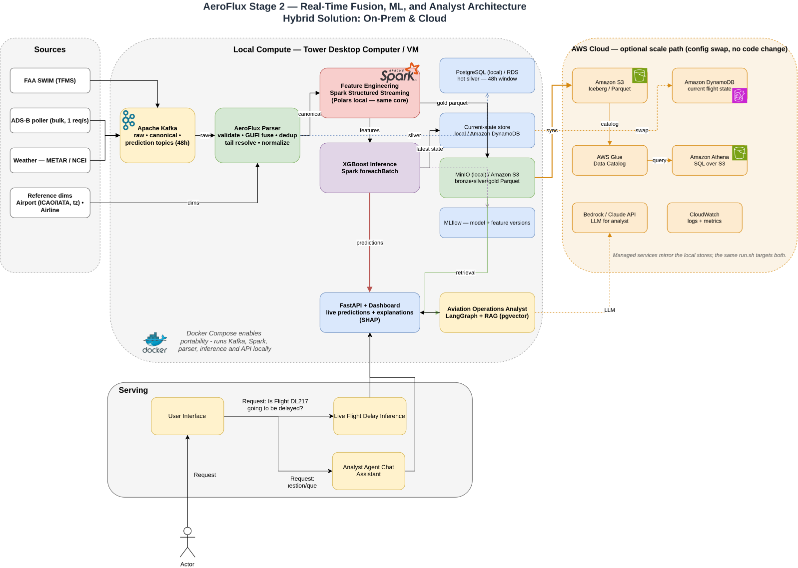

::: {.callout-note appearance="minimal"}
**Course:** AIT 614 Sec 001  
**Instructor:** Dr. Duoduo Liao  
**Institution:** George Mason University
:::

# Introduction

Flight delays are among the most costly and disruptive failures in the U.S.
National Airspace System (NAS), and they rarely occur in isolation. A single
late arrival propagates downstream through the same aircraft's rotation and
through shared airport departure and arrival queues, so a local disturbance
becomes a network-wide disruption. 

Although airlines, airports, and air traffic authorities increasingly use real-time and predictive decision-support systems, these capabilities are often specialized around particular organizations, operational domains, or stages of flight. For example, the FAA’s Traffic Flow Management System supports demand-and-capacity management across the National Airspace System, while Terminal Flight Data Manager integrates surface and national traffic-management data to improve airport operations [@faa_nextgen_2024; @faa_tfdm_2020]. Commercial platforms such as Sabre Mosaic support airline disruption recovery, and Assaia ApronAI uses computer vision and machine learning to monitor aircraft turnarounds and predict departure readiness [@sabre_disruption_management; @assaia_apronai]. Opportunities therefore remain for integrated research platforms that fuse multiple live aviation data streams, model delay propagation across the broader flight network, and support forecasting, simulation, data science, and AI-assisted analysis.

**Scope**. The long-term vision for AeroFlux is ambitious and continues to evolve. Stage 2 therefore focuses on building a scalable, modular, configurable, portable, and decoupled big-data platform that can ingest, fuse, process, and analyze aviation and weather data in real time. This platform is intended to establish the technical foundation for future AeroFlux capabilities.

Flight-delay prediction serves as the primary use case, but the architecture is designed to support additional applications, including congestion analysis, delay-propagation modeling, operational monitoring, decision support, and agentic AI. Stage 1 established a historical machine-learning pipeline and interactive prototype [@wilson2026flightdelay]. Stage 2 extends that work by introducing a live data platform, comparing baseline and advanced predictive models, and developing an explainable analyst agent as an initial prototype.

**Technical challenges.** Building this platform requires solving several
non-trivial problems: 

(1) Ingesting heterogeneous, error-prone streaming sources
(FAA SWIM XML, ADS-B, weather) without data loss; 
(2) *Entity resolution* across
systems that share no universal key—for example, the aircraft tail number is not
published in SWIM flight data and must be recovered from ADS-B which itself has limitations 
due to lack of coverage; 
(3) Unstable identifiers, since a flight's `flight_ref` changes on plan amendment while its
Globally Unique Flight Identifier (GUFI) remains stable; 
(4) Train-serve skew, because historical labels (Bureau of Transportation Statistics) and live
features are measured differently; and 
(5) Delivering all of this at demo quality on a portable, low-cost footprint.

Several of these challenges have already been partially addressed through a working end-to-end prototype pipeline. However, the proposed implementation is intended to reduce and manage these limitations rather than eliminate every possible source of missing data, ambiguity, or operational uncertainty.

# Related Work

**Machine-learning delay prediction.** Prior work frames delay prediction
as supervised classification or regression over historical records. The review
by @sternberg2017review describes the major approaches used for flight-delay
prediction, while more recent work continues to evaluate machine-learning
algorithms and class-imbalance handling [@albassam2025flight]. These approaches can achieve strong predictive performance on curated historical datasets. However, when used in isolation, they may remain largely retrospective, rely on a limited set of data sources, and model flights as independent observations. These assumptions can restrict their ability to capture the temporal, spatial, and operational dependencies through which delays propagate across the aviation network.

**Delay-propagation modeling.** A separate literature models how delays ripple
through airline schedules. @beatty1999preliminary introduced an early method for
evaluating delay propagation through an airline schedule, @wong2012survival
applied a survival model, and @kafle2016propagation proposed an
analytical-econometric approach. These methods capture important propagation
mechanisms but are generally offline and disconnected from real-time streaming
prediction. @belcastro2016flight demonstrated scalable data mining for flight-
delay prediction, establishing the value of big-data tooling while leaving room
for tighter integration with real-time data fusion.

**Operational data fusion.** The state of the art in operational systems
includes NASA's Airspace Technology Demonstration 2 (ATD-2) *Fuser*, which fuses
multiple aviation data sources into a unified flight record
[@nasa2021atd2fuser]. Its strength is production-grade fused operational data;
its limitation for this project is that it is not designed as a lightweight,
open, extensible ML/AI experimentation platform. This project actually leverages some of the high level
concepts used in ATD-2 to create our own fuser. 

**Emerging aviation intelligence systems.** Recent operational systems show that the field is moving beyond static delay prediction toward real-time prediction, simulation, and decision support. FlightAware Foresight represents production ML-driven predictive flight tracking, including arrival-time, taxi-out, and runway predictions [@flightawareForesight]. NASA’s NAS Digital Twin and Project Bluebird extend this direction toward replayable and probabilistic simulation environments for live or historical airspace operations and AI-agent evaluation [@lauderdale2024nasDigitalTwin; @pepper2026probabilisticTwin]. Commercial platforms such as Airspace Intelligence PRESCIENCE, Lufthansa Systems NetLine/Ops++ aiOCC, and Amadeus Flight Operations Control show the market moving toward 4D operating-domain twins, AI-assisted operations control, disruption recovery, and resource-aware decision support [@airspaceIntelligencePrescience; @lufthansa2025aiocc; @amadeusFlightOps]. Recent prototypes such as FlightSense further combine rotation-chain features, real-time MLOps, and conversational/agentic interfaces for delay prediction [@shelke2026flightsense], while the FAA AI safety roadmap highlights the need for assurance, incremental deployment, and aviation-specific safety methods when adding AI to operational contexts [@faa2024airoadmap]. Together, these efforts motivate AeroFlux as a lightweight, SWIM-native experimentation platform that connects real-time data fusion, propagation-aware ML, replay, and explainable/agentic analysis rather than treating delay prediction as a standalone model.


**Relevance of this approach.** AeroFlux Stage 2 bridges these strands. It
couples lightweight, Fuser-inspired real-time fusion and entity resolution with
propagation-aware feature engineering and an explainable retrieval-augmented
agent—integrating capabilities that prior work often treats separately.

# Objectives

1. Ingest and fuse FAA SWIM, ADS-B, and weather data into a validated, per-flight
   canonical state in real time.
2. Deliver a portable, decoupled platform that runs unchanged on a laptop,
   school hardware, or any cloud VM (container-first, cloud-agnostic).
3. Compare a baseline model against an advanced, propagation- and
   weather-aware model for arrival-delay prediction.
4. Evaluate both **predictive** performance and **system** performance.
5. Develop and evaluate a starter Aviation Operations Analyst that uses retrieval, model invocation, explainability, and structured tool calling to produce evidence-grounded disruption-investigation briefs without making operational decisions.
6. Define stable tool interfaces that can later support knowledge graphs, operational-event replay, simulation, MCP integration, and specialized agent workflows without requiring replacement of the underlying data platform.

# Datasets

The platform fuses live and historical aviation and weather sources, plus reference dimensions and a documentation corpus, summarized in @tbl-datasets. FAA SWIM provides the authoritative live NAS flight state [@faa_swim]; ADS-B supplies the physical airframe identity (ICAO 24-bit address and registration) needed to link an aircraft's successive legs, drawn from community feeds [@airplaneslive; @adsblol], whose research value is demonstrated by large-scale networks such as OpenSky [@schaefer2014opensky]; NOAA weather—a leading delay driver—is drawn from live METAR via the Aviation Weather Center [@awc_metar] for serving and the NCEI Integrated Surface Database for historical training [@ncei_isd]; and the BTS On-Time Performance dataset, which includes actual gate times and tail numbers, provides historical training labels [@bts_ontime]. Reference dimensions for airports and airlines [@ourairports; @openflights] support entity resolution, code normalization, and timezone alignment.

| Source | Type | Role | Retention | Estimated retained size |
|---|---|---|---|---|
| FAA SWIM (TFMS) | Streaming XML | Live flight state (primary) | 48 h | Approximately 5–25 GB |
| ADS-B (airplanes.live / adsb.lol) | Streaming JSON | Airframe and tail resolution | 48 h | Approximately 2–10 GB |
| NOAA weather — METAR (AWC) + NCEI ISD hourly | Polled JSON / text | Weather: METAR for serving, NCEI for training | 48 h | Approximately 50–250 MB live |
| BTS On-Time Performance | Historical CSV / Parquet | Historical training labels | Persistent | Approximately 20–40 GB as CSV or 4–10 GB as Parquet |
| Aviation documents (FAA, SWIM dictionaries, and related references) | PDF / HTML / text | RAG documentation corpus | Persistent | Approximately 0.5–2 GB, including extracted text and embeddings |
| Reference dimensions (airports, airlines) | Static CSV | 	Entity resolution, ICAO/IATA + timezone normalization | Persistent | < 50 MB |

: AeroFlux Stage 2 data sources, retention policies, and estimated storage requirements. Estimated sizes are project-planning ranges rather than published source totals and depend on geographic scope, ingestion frequency, selected fields, compression, and duplicate handling. {#tbl-datasets}

A raw SWIM message (abridged) is shown in @lst-swim; the corresponding fused,
validated canonical record produced by the ingestion pipeline is shown in
@lst-record. Each SWIM document explodes into one record per flight, which the
pipeline fuses by GUFI across many messages over time.

```{.xml #lst-swim lst-cap="Raw SWIM TFMS flight message (abridged)."}
<fdm:fltdMessage acid="AAL2033" airline="AAL" arrArpt="KLGA" depArpt="KCLT"
   flightRef="150976233" msgType="FlightModify" ...>
  <nxcm:flightStatus>PLANNED</nxcm:flightStatus>
  <nxcm:aircraftModel>A320</nxcm:aircraftModel>
  <nxcm:flightTimeData airlineOutTime="2026-07-04T15:39:00Z"
                       airlineInTime="2026-07-04T17:35:00Z"/>
</fdm:fltdMessage>
```

```{.json #lst-record lst-cap="Fused, schema-validated canonical flight-instance record."}
{ "flight_instance_id": "KN6770564K", "callsign": "AAL2033",
  "flight_number": "AA2033", "carrier_name": "American Airlines",
  "origin": "KCLT", "destination": "KLGA", "aircraft_type": "A320",
  "scheduled_gate_departure": "2026-07-04T15:39:00Z",
  "estimated_arrival": "2026-07-04T17:41:00Z", "flight_status": "PLANNED",
  "resolution_status": "airline_resolved", "schema_version": "1.0" }
```

# Methodology and Proposed Solution

**Architecture.** AeroFlux Stage 2 is a streaming lakehouse: heterogeneous
aviation and weather sources are ingested continuously, processed by a
distributed compute engine, and persisted across bronze → silver → gold tiers.
Every component runs as a container, so the platform deploys unchanged on a
laptop, university hardware, or a single cloud VM, with managed AWS services as
an optional scale path rather than a requirement. The full architecture is shown
in @fig-aeroflux2-arch.

::: {.content-visible when-format="html"}
{#fig-aeroflux2-arch .lightbox}
:::

::: {.content-visible when-format="pdf"}
{#fig-aeroflux2-arch-pdf}
:::

**Ingestion and streaming.** Dedicated services publish each source—SWIM flight
messages, ADS-B, and weather—to a dedicated Apache Kafka topic with 48-hour
retention, decoupling producers from consumers and providing a replayable event
history. Apache Spark Structured Streaming consumes these topics as the
platform's primary big-data compute engine, applying the `aeroflux_parser`
library to validate each message against a strict schema contract and fuse
messages into per-flight canonical records—keyed on the stable GUFI, with ADS-B
used to resolve the aircraft tail that SWIM omits.

**Storage tiers and retention.** Processing follows a bronze → silver → gold
progression. Raw and fused per-flight state are held hot in PostgreSQL on a
rolling 48-hour window; current per-flight predictions are served from a NoSQL
store (Amazon DynamoDB in the cloud); and canonical and gold feature/label tables
are written as partitioned Parquet to a MinIO / Amazon S3 data lake, queryable in
place through Amazon Athena over an AWS Glue catalog. Short retention keeps the
streaming footprint small and low-cost, while the lake retains durable history
for training and replay. Because storage backends sit behind configuration, the
local stack (PostgreSQL, MinIO) swaps to managed cloud services (RDS, S3) with no
code change.

**Machine learning.** The same Spark engine runs feature engineering and XGBoost
inference via `foreachBatch`, comparing a logistic-regression baseline against an
advanced gradient-boosted model enriched with propagation, weather, and rolling
airport-demand features [@chen2016xgboost; @beatty1999preliminary;
@kafle2016propagation]. Feature engineering is expressed once in a source-agnostic
core, so historical (BTS) training and live serving compute identical features by
construction; that core runs on Polars locally for development and in Spark at
scale. Both models target a 15-minute arrival-delay classification, are tracked
in MLflow, and are explained with SHAP [@lundberg2017shap].

**AI orchestration prototype.** A lightweight *Aviation Operations Analyst* uses
retrieval-augmented generation [@lewis2020rag] and a constrained LangGraph
workflow over a curated aviation-document corpus to produce cited, evidence-
grounded briefs; it does not touch live streaming data or make operational
decisions, and is evaluated on a small set of reviewed questions for
groundedness, citation accuracy, and appropriate tool use. As an optional stretch
goal, a read-only Model Context Protocol (MCP) server may expose these tools
through a standardized interface.

**Evaluation.** Both predictive and system performance are evaluated.

# Development Environment

The stack (@tbl-stack) is entirely open-source and container-first. Every
component runs as a Docker Compose service, so the platform deploys unchanged on
a laptop, university hardware, or a single cloud VM; managed AWS services (MSK,
EMR, SageMaker) are an optional scale path rather than a requirement. MinIO
provides an S3-compatible object store that swaps to real S3 with no code change.
Short retention keeps storage and cost minimal (target budget: a modest VM plus a
few dollars of LLM API usage).

| Category | Tools |
|---|---|
| Language | Python 3.11 |
| Streaming | Apache Kafka, Spark Structured Streaming |
| Storage | MongoDB, PostgreSQL + pgvector, MinIO / Amazon S3 |
| Historical replay | Kafka offsets and immutable Parquet event history in MinIO / S3 |
| ML | scikit-learn, XGBoost, Spark ML, MLflow, SHAP |
| AI orchestration | LangGraph constrained workflow with read-only tool calling |
| LLM / RAG | Claude API or Amazon Bedrock; pgvector semantic retrieval |
| Agent tools | Document search, operational-data query, model inference, SHAP explanation, event reconstruction |
| Serving / UI | FastAPI, Dash / Plotly |
| Orchestration | Prefect, Airflow or other |
| Interoperability | Optional read-only AeroFlux MCP server |
| Packaging / Platform | Docker Compose; optional AWS EC2, S3, and EMR Serverless |

: Development environment and technology stack. {#tbl-stack}

# Project Tasks and Timeline

The minimum implementation is scoped to approximately one month (@tbl-timeline),
building on Stage 1's completed ingestion, fusion, entity-resolution, schema
contract, and baseline model. Future capabilities—graph analytics, simulation,
digital twin, and a multi-agent system—are explicitly out of scope for this
timeline.

| Week | Tasks | Est. hours |
|---|---|---|
| 1 | Complete streaming and weather integration; prepare MongoDB records, documentation corpus, and two or three historical investigation scenarios | 20 |
| 2 | Feature engineering; baseline and advanced model evaluation; MLflow tracking; SHAP explanation service | 22 |
| 3 | Build pgvector retrieval pipeline and LangGraph analyst workflow; implement document-search, flight-query, prediction, explanation, and event-reconstruction tools | 22 |
| 4 | Integrate the analyst UI; create agent evaluation cases; measure groundedness, tool selection, latency, and predictive/system performance; complete demonstration and write-up | 18 |

: One-month project timeline and effort allocation. {#tbl-timeline}

# References {.unnumbered}

::: {#refs}
:::
